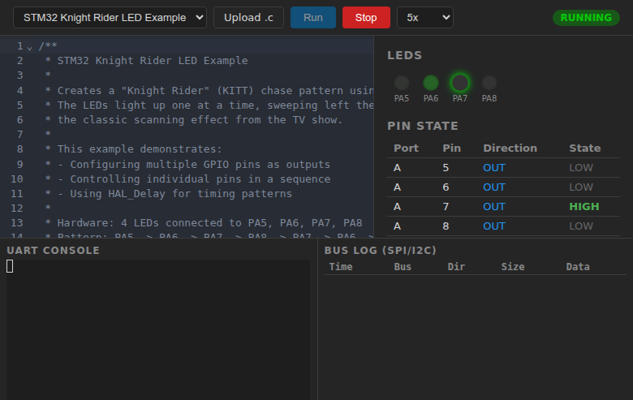
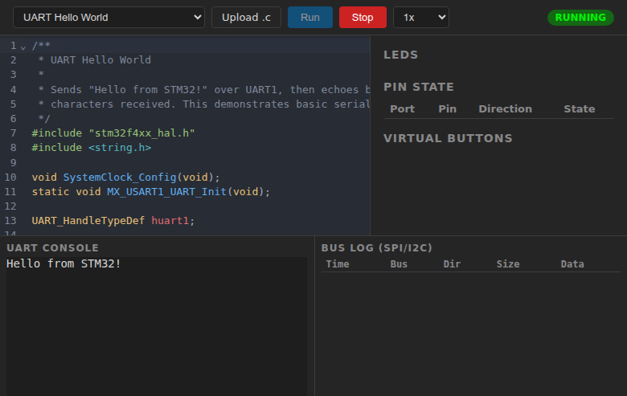
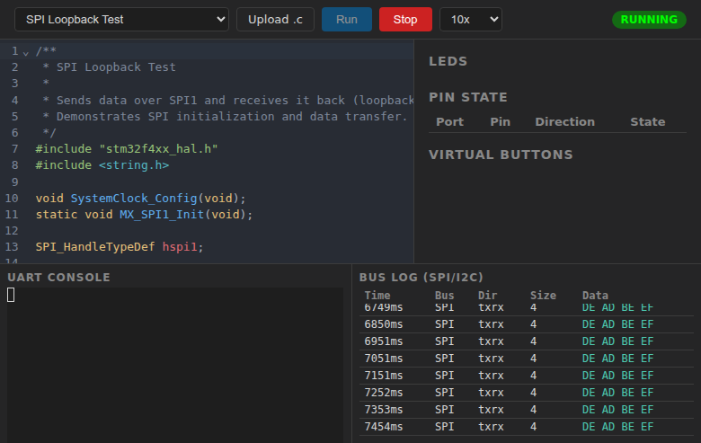

# STM32 Virtual Test Bench

A web-based simulator for STM32F4 firmware. Write C code in a browser editor, compile it server-side, and watch your firmware run with virtual LEDs, a UART serial console, GPIO pin state visualization, and an SPI/I2C bus log — no dev board required.



### More screenshots

| UART serial console | SPI bus log |
|---|---|
|  |  |

## Features

- **Code editor** — CodeMirror with C/C++ syntax highlighting and the One Dark theme
- **Sample projects** — 5 built-in examples (blink, button+LED, knight rider, UART hello, SPI loopback)
- **File upload** — load your own `.c` files
- **GPIO simulation** — virtual LEDs light up on pin writes, pin state table shows all configured pins
- **Virtual buttons** — input pins automatically get clickable buttons for GPIO input
- **UART console** — xterm.js terminal with bidirectional serial I/O (TX output + RX echo)
- **SPI/I2C bus log** — tabular view of bus transfers with timestamps and hex data
- **Speed control** — run simulations at 0.25x to 10x speed
- **Real-time updates** — WebSocket streaming of all peripheral events

## How it works

Instead of emulating an ARM CPU, the simulator compiles your C code against a **mock HAL layer** using the host's native GCC. The mock HAL stubs (`hal/`) implement the STM32 HAL API but emit JSON events to stdout instead of touching real hardware. The server streams these events over WebSocket to the browser UI.

```
Your C code + Mock HAL stubs
        |
        v
   gcc (host-native)
        |
        v
   Native binary (subprocess)
        |  stdout: JSON events
        v
   Bun server (WebSocket pub/sub)
        |
        v
   Browser UI (LEDs, UART terminal, pin table, bus log)
```

## Quick start

**Prerequisites:** [Bun](https://bun.sh/) and GCC

```bash
# Install dependencies
bun install

# Build frontend and start server
bun run dev

# Open http://localhost:3000
```

## Project structure

```
src/
  server/          # Bun HTTP + WebSocket server
    compiler/      # GCC compilation pipeline
    runner/        # Subprocess management + stdout event parsing
    routes/        # REST API (compile, run, stop, samples)
    ws/            # WebSocket event broadcasting
  client/          # Browser UI (vanilla TypeScript)
    controls/      # Toolbar (run/stop/speed)
    editor/        # CodeMirror editor
    gpio/          # LED panel, pin table, virtual buttons
    uart/          # xterm.js UART terminal
    bus/           # SPI/I2C bus log table
    sim/           # WebSocket client + API helpers
hal/
  include/         # STM32 HAL header stubs (stm32f4xx_hal_*.h)
  src/             # Mock implementations (GPIO, UART, SPI, I2C events)
samples/           # Built-in sample firmware projects
tests/             # Integration tests (Bun test runner)
```

## Samples

| Sample | What it does |
|--------|-------------|
| **Blink** | Toggles PA5 LED every 500ms |
| **Button + LED** | Reads PA0 button input, controls PA5 LED |
| **Knight Rider** | 4-LED chase pattern on PA5-PA8 |
| **UART Hello** | Sends greeting over UART1, echoes received characters |
| **SPI Loopback** | Transmits `0xDEADBEEF` over SPI1 in a loop |

## API

| Endpoint | Method | Description |
|----------|--------|-------------|
| `/api/compile` | POST | Compile C source code |
| `/api/run` | POST | Start simulation from compiled binary |
| `/api/stop` | POST | Stop running simulation |
| `/api/samples` | GET | List available sample projects |
| `/api/samples/:name` | GET | Get sample source code |
| `/ws?simulationId=X` | WS | Real-time simulation event stream |

## Tests

```bash
bun test
```

## License

MIT
